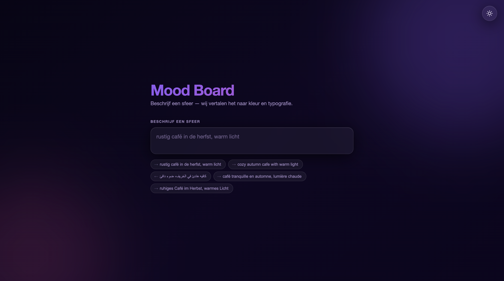
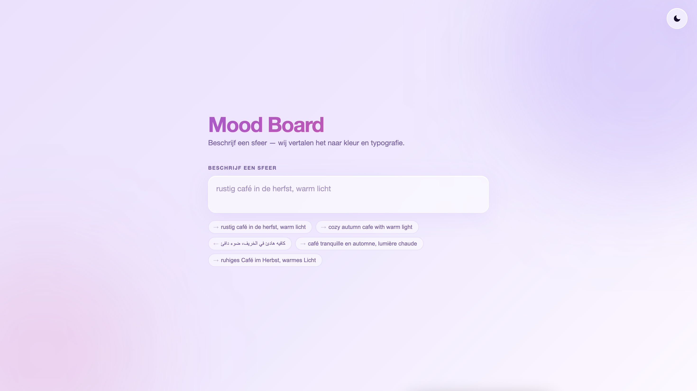

# Mood Board Generator

Describe a mood in plain text — for example "cozy autumn cafe, warm light" —
and instantly get a matching color palette, font, and mood tag.

Works in six languages: English, Dutch, Arabic, French, German, and Spanish.
The tool recognizes mood-related words regardless of language and maps them
to a shared system of ~40 visual concepts (cozy, calm, industrial, romantic, ...).

<p align="center">
  
  
</p>

## How it works

1. **Concepts** (`src/data/concepts.js`) — language-independent definitions:
   each concept has a color palette and a font.
2. **Translations** (`src/data/translations/{en,nl,ar,fr,de,es}.js`) — per
   language, a list of words/synonyms that map to a concept, plus translated
   mood tags.
3. **Matcher** (`src/lib/matcher.js`) — normalizes and tokenizes the input,
   matches words (with light stemming for inflections) against all language
   dictionaries, and picks the concept with the most hits.

## Running locally

```bash
npm install
npm run dev
```

## Building

```bash
npm run build
```

## Running with Docker

Build and run the production build behind a static web server:

```bash
docker compose up --build
```

Then open http://localhost:8080

Or without Compose:

```bash
docker build -t mood-board-generator .
docker run -p 8080:80 mood-board-generator
```

## Adding a new concept

1. Add the concept to `src/data/concepts.js` (colors + font).
2. Add the matching words and a translated tag to each file under
   `src/data/translations/`.

## Adding a new language

1. Create `src/data/translations/{language-code}.js` with a `words` and
   `tags` object, following the pattern of the existing files.
2. Import and register the language in `src/data/index.js`.
